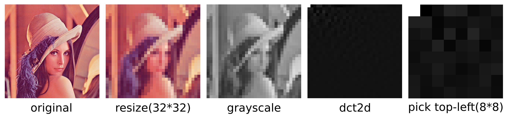

# phash-js

`phash-js` is a TypeScript library for generating perceptual hashes (pHash) of images, allowing efficient and fast image comparison. This library is ideal for checking if a user’s avatar is among existing images in your database, making it easy to quickly identify similar images based on their perceptual characteristics.

## Why pHash?

There are several popular image hashing techniques, including `aHash` (average hash), `dHash` (difference hash), and `pHash` (perceptual hash). While `aHash` and `dHash` are simpler, they may fail to detect subtle differences in more complex images. `pHash` is a more advanced algorithm that leverages perceptual hashing to capture the overall appearance of an image by focusing on features that human eyes are sensitive to. This makes it more robust for comparing images that may vary slightly due to scaling, cropping, or minor alterations.

## Process



1. Reduce the image to 32\*32 pixels, taking into account both complexity and quality
2. Grayscale image
3. Apply DCT 2d
4. It is the best way to binarize the whole 32\*32 pixels. But to make calculation efficient, we pick top-left 8\*8 pixels, which are with high frequencies.
5. Calculate the average of the matrix, and then turn the pixel, of which the value greater than average, to 1, otherwise 0. Finally we will get such a binary string `1001100111000100010101000010010100000000001000111010001010000000`
6. Convert binary to hex each 4 digits as a group. E.g., `1001` to `9`, `1100` to `c`. The phash of the original image will be `99c454250023a280`.

## Discrete Cosine Transform (DCT)

At the core of the `pHash` algorithm is the Discrete Cosine Transform (DCT), a mathematical operation that transforms an image into its frequency domain. By extracting and compressing frequency components, DCT enables `pHash` to create a unique, fixed-length hash representing the perceptual content of an image. This hash is resilient to small changes, making it effective for image comparison.

##### DCT 1d


##### DCT 2d


## TypeScript Advantage

Existing `pHash` libraries are primarily written in JavaScript, but `phash-js` is the first library built fully in TypeScript. This provides better type-checking, easier code maintenance, and improved developer experience, making it a great choice for modern TypeScript projects.

## Examples

### For node environments

In node environment, `@phash-js/server` will use sharp to convert images to RGBA data.

```bash
npm install @phash-js/server
# yarn install @phash-js/server
# pnpm install @phash-js/server
```

```typescript
import { phash, calcDistance } from "@phash-js/server";

// To generate phash
const hash1 = await phash("./image1.png");
const hash2 = await phash("./image2.png");

// To calculate the hamming distance
const distance = calcDistance(hash1, hash2);
```

### For browser environments

In node environment, `@phash-js/client` will use canvas to convert images to RGBA data.

```bash
npm install @phash-js/client
# yarn install @phash-js/client
# pnpm install @phash-js/client
```

```typescript
const handleImageChange = (e: React.ChangeEvent<HTMLInputElement>) => {
  const file = e.target.files?.[0];
  if (file) {
    const reader = new FileReader();
    reader.onloadend = async () => {
      const _hash = await phash(file);
      return _hash;
    };
    reader.readAsDataURL(file);
  }
};
```

### Use core module directly

Both `@phash-js/server` and `@phash-js/client` rely on `@phash-js/core`. If you need to use core functions like DCT or normalize, import them from `@phash-js/core`.

```bash
npm install @phash-js/core
# yarn install @phash-js/core
# pnpm install @phash-js/core
```

```typescript
import { /* dct1d */, dct2d, /* binarize */, normalize } from "@phash-js/core";
import sharp from "sharp";

// Do the dct2d for a image
const matrix = await dct2d(matrix as number[][]);

// As the value can be larger than 255 or negative after DCT, normalize the matrix to make it greyscale.
const normalizedMatrix = normalize(matrix);

const height = normalizedMatrix.length;
const width = normalizedMatrix[0].length;
const flatData = Uint8Array.from(normalizedMatrix.flat());

// Save the new image after DCT to local
await sharp(flatData, {
  raw: {
    width: width,
    height: height,
    channels: 1, // Single channel for grayscale
  },
}).toFormat("png").toFile('./image.png');
```

## Known Issues

1. Hash by `@phash-js/server` and `@phash-js/clinet` will be a little different as sharp and canvas have various conversion algorithms. For the example of Lenna.png, `@phash-js/server` will return `99c454250023a280`, while `@phash-js/client` will return `99c4542540238280`. Therefore, it's not supported to mix `@phash-js/server` and `@phash-js/client`.
